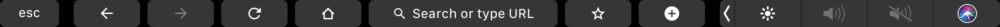
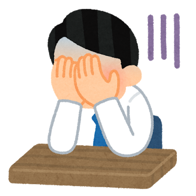
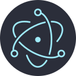
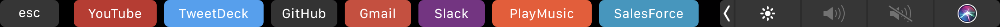
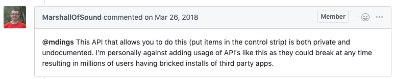

import { Avatar } from '../../components';
export { Themes } from '../../deck/Themes.tsx';

## JS で TouchBar のアプリを作ろう

[We Are JavaScripters! @34th](https://wajs.connpass.com/event/138500)
@natural_clar

---

## 自己紹介

<Avatar />

- Jesse Katsumata アメリカ人 :flag-us:
- CureApp - React Native を使った治療アプリの開発
- Twitter: [@natural_clar](https://twitter.com/natural_clar) Github: [@Naturalclar](https://github.com/Naturalclar)

---

## TouchBar



---

## MacBookPro を買ったきっかけ

- 元々 Windows を使ってた
- 友達に Touchbar を見せてもらった
- なにこれかっこいい！

---

## 買って数日後の現実

- 音楽再生と音量調整にしか使わない…



---

- どうにかして使えないか:thinking_face:
- よく開くものだけでも表示させときたい
- JS で書けたら書きたい

---

## Electron



---

### TouchBar API

- https://electronjs.org/docs/api/touch-bar

---

#### touchbar.ts

使い方は簡単！

```ts 
import { app, BrowserWindow, TouchBar, globalShortcut } from 'electron'
import { buttons } from './Buttons'

const { TouchBarButton } = TouchBar

app.once('ready', () => {
  // Register a 'ControlOrControl+X' shortcut listener.
  const toggleShortcut = globalShortcut.register('Control+X', () => {
    window.isFocused() ? window.hide() : window.show()
  })

  if (!toggleShortcut) {
    console.log('registration failed')
  }

  const window = new BrowserWindow({
    frame: false,
    width: 1080,
    height: 800,
    backgroundColor: '#0000',
    transparent: true,
    movable: true,
  })

  const touchBar = new TouchBar({
    items: buttons.map(
      ({ label, backgroundColor, url }) =>
        new TouchBarButton({
          label,
          backgroundColor,
          click: () => {
            window.loadURL(url)
          },
        })
    ),
  })

  window.setTouchBar(touchBar)
})

app.on('will-quit', () => {
  // Unregister all shortcuts.
  globalShortcut.unregisterAll()
})
```

---

#### touchbar.ts

importして

```ts {1-4}
import { app, BrowserWindow, TouchBar, globalShortcut } from 'electron'
import { buttons } from './Buttons'

const { TouchBarButton } = TouchBar

app.once('ready', () => {
  // Register a 'ControlOrControl+X' shortcut listener.
  const toggleShortcut = globalShortcut.register('Control+X', () => {
    window.isFocused() ? window.hide() : window.show()
  })

  if (!toggleShortcut) {
    console.log('registration failed')
  }

  const window = new BrowserWindow({
    frame: false,
    width: 1080,
    height: 800,
    backgroundColor: '#0000',
    transparent: true,
    movable: true,
  })

  const touchBar = new TouchBar({
    items: buttons.map(
      ({ label, backgroundColor, url }) =>
        new TouchBarButton({
          label,
          backgroundColor,
          click: () => {
            window.loadURL(url)
          },
        })
    ),
  })

  window.setTouchBar(touchBar)
})

app.on('will-quit', () => {
  // Unregister all shortcuts.
  globalShortcut.unregisterAll()
})
```

---

#### touchbar.ts

ボタンに何をするか設定して

```ts {25-33}
import { app, BrowserWindow, TouchBar, globalShortcut } from 'electron'
import { buttons } from './Buttons'

const { TouchBarButton } = TouchBar

app.once('ready', () => {
  // Register a 'ControlOrControl+X' shortcut listener.
  const toggleShortcut = globalShortcut.register('Control+X', () => {
    window.isFocused() ? window.hide() : window.show()
  })

  if (!toggleShortcut) {
    console.log('registration failed')
  }

  const window = new BrowserWindow({
    frame: false,
    width: 1080,
    height: 800,
    backgroundColor: '#0000',
    transparent: true,
    movable: true,
  })

  const touchBar = new TouchBar({
    items: buttons.map(
      ({ label, backgroundColor, url }) =>
        new TouchBarButton({
          label,
          backgroundColor,
          click: () => {
            window.loadURL(url)
          },
        })
    ),
  })

  window.setTouchBar(touchBar)
})

app.on('will-quit', () => {
  // Unregister all shortcuts.
  globalShortcut.unregisterAll()
})
```

---

#### touchbar.ts

Setするだけ！

```ts {38}
import { app, BrowserWindow, TouchBar, globalShortcut } from 'electron'
import { buttons } from './Buttons'

const { TouchBarButton } = TouchBar

app.once('ready', () => {
  // Register a 'ControlOrControl+X' shortcut listener.
  const toggleShortcut = globalShortcut.register('Control+X', () => {
    window.isFocused() ? window.hide() : window.show()
  })

  if (!toggleShortcut) {
    console.log('registration failed')
  }

  const window = new BrowserWindow({
    frame: false,
    width: 1080,
    height: 800,
    backgroundColor: '#0000',
    transparent: true,
    movable: true,
  })

  const touchBar = new TouchBar({
    items: buttons.map(
      ({ label, backgroundColor, url }) =>
        new TouchBarButton({
          label,
          backgroundColor,
          click: () => {
            window.loadURL(url)
          },
        })
    ),
  })

  window.setTouchBar(touchBar)
})

app.on('will-quit', () => {
  // Unregister all shortcuts.
  globalShortcut.unregisterAll()
})
```

---

#### touchbar.ts

HotKeyも設定できる！

```ts {8-10}
import { app, BrowserWindow, TouchBar, globalShortcut } from 'electron'
import { buttons } from './Buttons'

const { TouchBarButton } = TouchBar

app.once('ready', () => {
  // Register a 'ControlOrControl+X' shortcut listener.
  const toggleShortcut = globalShortcut.register('Control+X', () => {
    window.isFocused() ? window.hide() : window.show()
  })

  if (!toggleShortcut) {
    console.log('registration failed')
  }

  const window = new BrowserWindow({
    frame: false,
    width: 1080,
    height: 800,
    backgroundColor: '#0000',
    transparent: true,
    movable: true,
  })

  const touchBar = new TouchBar({
    items: buttons.map(
      ({ label, backgroundColor, url }) =>
        new TouchBarButton({
          label,
          backgroundColor,
          click: () => {
            window.loadURL(url)
          },
        })
    ),
  })

  window.setTouchBar(touchBar)
})

app.on('will-quit', () => {
  // Unregister all shortcuts.
  globalShortcut.unregisterAll()
})
```

---

### Touchbar Shortcut

- https://github.com/Naturalclar/tbs



---

### Touchbar Shortcut

- ボタンで URL 開くだけ
- ホットキーでどこからでも呼び出し可能

---

## 注意点

- TouchBar が表示されるのはアプリを開いている間のみ
- TouchBar の右側に常駐しているアイコンは[非公開](https://github.com/electron/electron/issues/12431) API で、Electron は提供していない



---

## まとめ

- 既存の Electron のアプリと合わせることも可能（そっちがメイン）
- Touchbar 領域にフォーカスすれば、できることが少ないので、作りやすい
- みんなで TouchBar 有効活用していこう

---

## 便利ツール/資料

- [TouchBar Simulator](https://github.com/sindresorhus/touch-bar-simulator) : TouchBar の Simulator
- [electron-store](https://github.com/sindresorhus/electron-store) : 状態管理ツール
- [Keyboard Shortcut](https://electronjs.org/docs/tutorial/keyboard-shortcuts) : ホットキーの設定

---

## ありがとうございました
