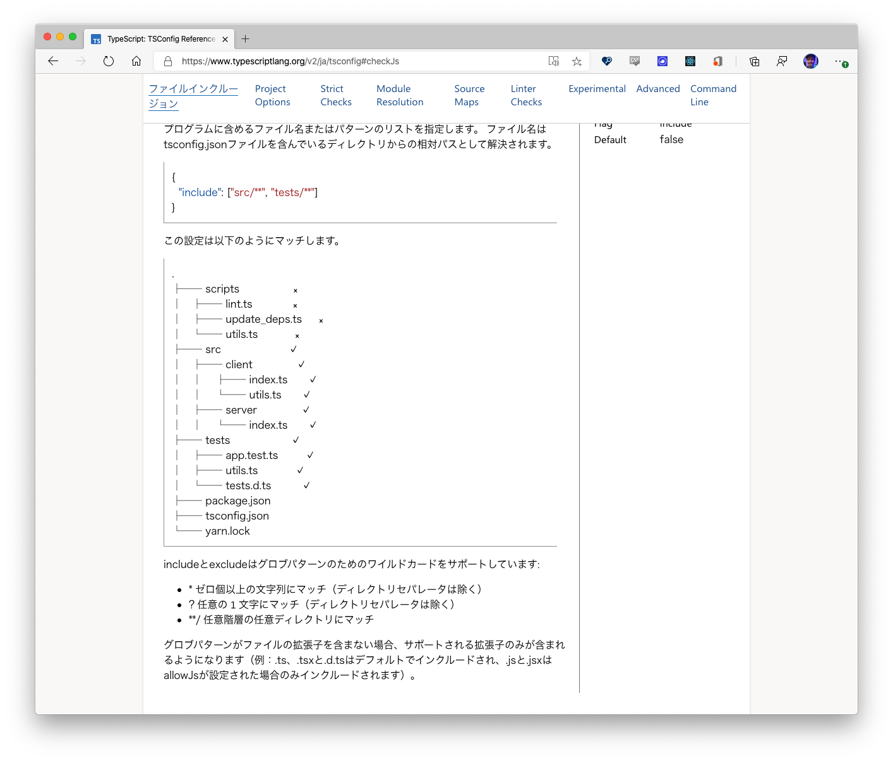
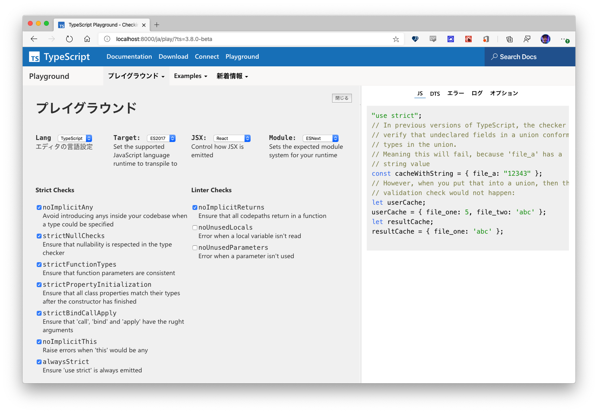
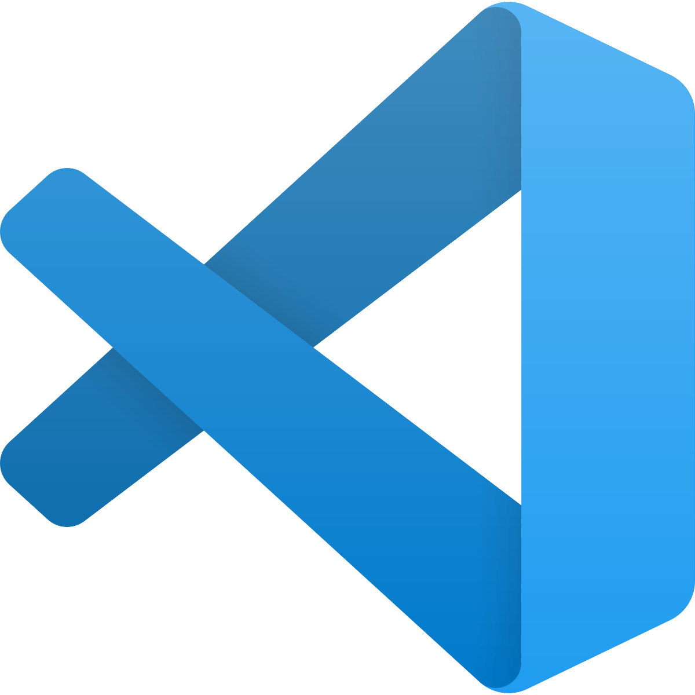
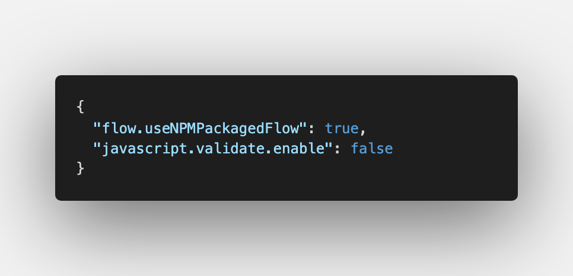
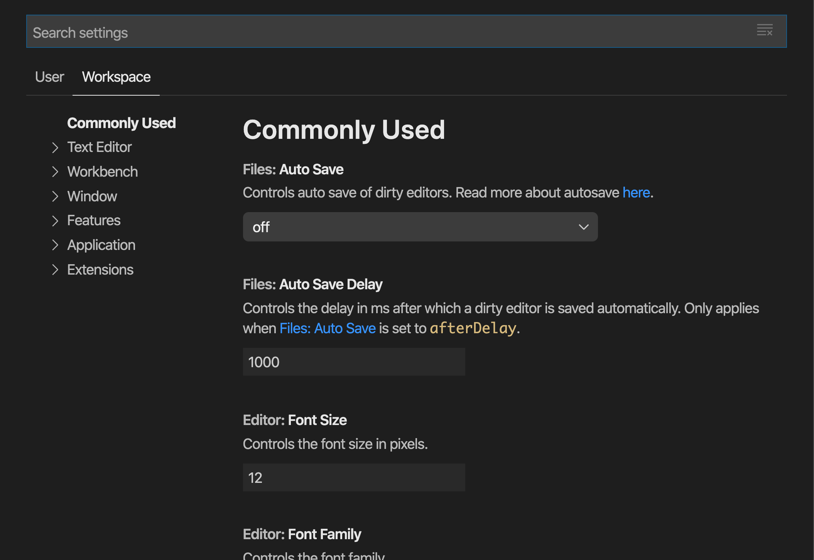
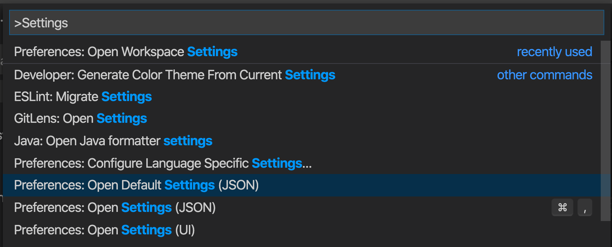
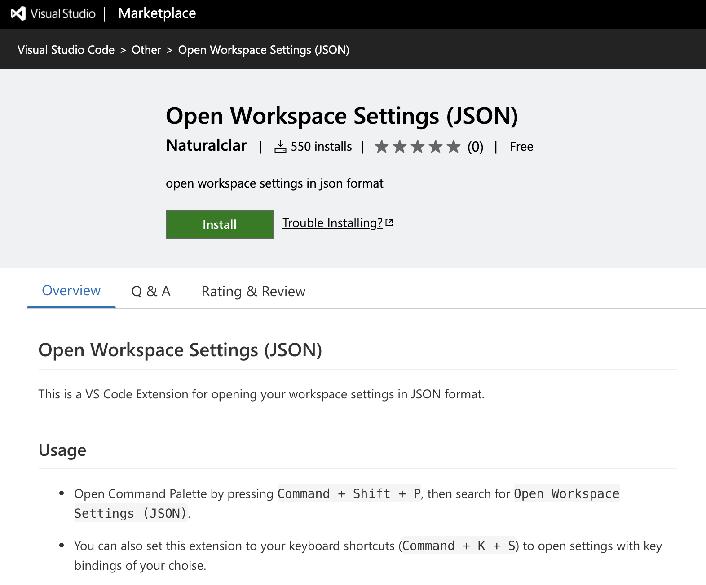

import { Profile } from '../../components';
export { Themes } from '../../deck/Themes.tsx';

## Creating your own extensions

[VSCode Meetup #3](https://vscode.connpass.com/event/166047/)
@naturalclar

{/* Title */}

---

## About Me

<Profile />

{/* Introduction */}

---

### TypeScript Website

<div style={{display:"flex", justifyContent:"center"}}>
  
  
</div>

---

### VS Code extensions



---

### OSS at React Native Community

<div style={{display:"flex", justifyContent:"center"}}>
  
  
</div>

---

### TypeScript and Flow

<div style={{display:"flex", justifyContent:"center"}}>
  
  
</div>

---

### VS Code settings for Flow



---

### VS Code Workspace Settings



---

# I want to write it in JSON!

---

### No command for Workspace Settings (JSON)



---

### So I made it

[Workspace Settings](https://github.com/Naturalclar/workspace-settings.git)



---

### How to make extensions

[Your First Extension](https://code.visualstudio.com/api/get-started/your-first-extension)

---

#### Install Yeoman and Generator for VSC Exttension

```bash
yarn global add yo generator-code
```

---

#### Run Yeoman Generator

```bash
yo code
```

---

#### Answer Questions

```bash
yo code

# ? What type of extension do you want to create? New Extension (TypeScript)
# ? What's the name of your extension? HelloWorld
### Press <Enter> to choose default for all options below ###

# ? What's the identifier of your extension? helloworld
# ? What's the description of your extension? LEAVE BLANK
# ? Initialize a git repository? Yes
# ? Which package manager to use? npm
```

---

# Debug It

[Debugger Extension](https://code.visualstudio.com/api/extension-guides/debugger-extension)

---

# Publish It

[Publishing extension](https://code.visualstudio.com/api/working-with-extensions/publishing-extension)

---

### vsce 

cli for vs code extension

```
yarn global add vsce
```

---

### One command to publish

```
vsce publish
```

---

# That's it!

---

THANK YOU
