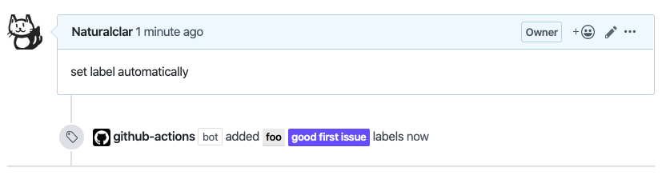
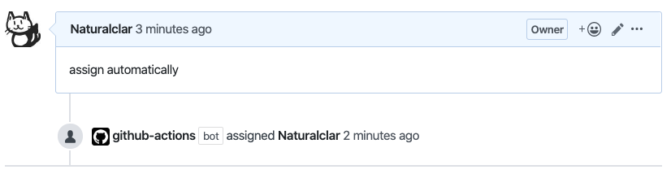
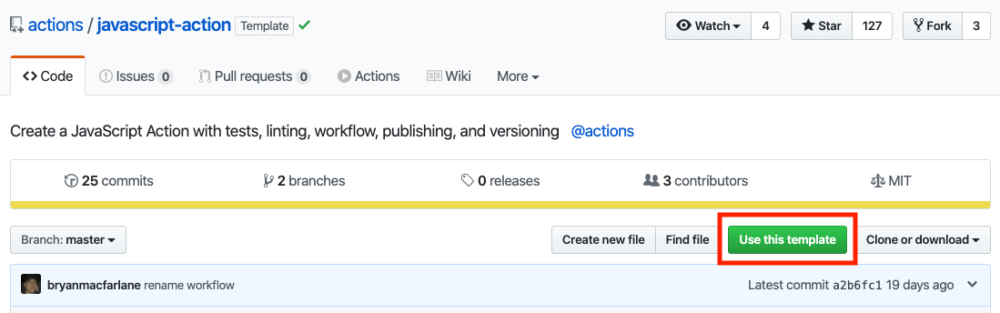

import { Avatar, Profile } from '../../components';
export { Themes } from '../../deck/Themes.tsx';

## Creating your own github actions

[GitHub Actions Meetup Tokyo β](https://gaugt.connpass.com/event/147220/)
@naturalclar

---

## About Me

<Avatar />
<Profile />

{/* まずは自己紹介です。Jesseと申します。アメリカ人です。 去年の9月に日本に引っ越してきました。 CureAppという会社で主にReact Native と TypeScript を扱った医療系のアプリを開発しています。 */}

---

### How we use CI/CD

- Visual Regression Test: CircleCI
- Build/Deploy: Bitrise
- Test/Lint/Typecheck: **Github Actions**

---

### Target Audience

<div style={{ display: "flex", justifyContent: "center" }}>
  
  
</div>

- JavaScript, TypeScript users
- *Docker can also be used for other languages such as Go/Ruby

---

### What I Made

[Issue Labeler](https://github.com/marketplace/actions/issue-labeler)

- Automatically set Label or Assignee an Issue
- Looks for keyword in Issue body or title as a trigger

---

### Example

<div
  style={{ display: "flex", flexDirection: "column", justifyContent: "center" }}
>
  
  <div style={{ marginBottom: 8 }} />
  
</div>

---

### How I made it

---

## [actions-toolkit](https://github.com/actions/toolkit)

<div>
  <div style={{ display: "flex", justifyContent: "center" }}>
    
  </div>
</div>

---

#### actions-toolkit

```md
Consists of

- @actions/core
- @actions/exec
- @actions/io
- @actions/github
- @actions/tool-cache
```

---

#### Explaining

```md
Consists of

- @actions/core
- @actions/exec
- @actions/io
- @actions/github
- @actions/tool-cache
```

---

#### @action/core

```ts
import * as core from "@actions/core";
```

---

#### getInput

```ts
import * as core from "@actions/core";

const myInput = core.getInput("inputName");
```

---

#### getInput

```ts
import * as core from "@actions/core";

const myInput = core.getInput("inputName", { required: true });
// throws error if required input is not given
```

---

#### setOutput

```ts
import * as core from "@actions/core";

const myInput = core.getInput("inputName", { required: true });
// throws error if required input is not given

core.setOutput("outputKey", "outputVal");
// output can be used in other actions as input
```

---

#### setSecret

```ts
import * as core from "@actions/core";

const myInput = core.getInput("inputName", { required: true });
// throws error if required input is not given

core.setOutput("outputKey", "outputVal");
// output can be used in other actions as input

core.setSecret("myPassword");
// set secret variable that can be used with the runner
```

---

#### setFailed

```ts
import * as core from "@actions/core";

const myInput = core.getInput("inputName", { required: true });
// throws error if required input is not given

core.setOutput("outputKey", "outputVal");
// output can be used in other actions as input

core.setSecret("myPassword");
// set secret variable that can be used with the runner

core.setFailed("Action failed with error");
// end runner with fail status
```

---

#### @actions/github

```ts {1-2}
import * as github from "@actions/github";
import * as core from "@actions/core";
```

---

#### @actions/github

```ts
import * as github from "@actions/github";
import * as core from "@actions/core";

async function run() {
  try {
    const myToken = core.getInput("myToken");

    const octokit = new github.GitHub(myToken);

    const { data: pullRequest } = await octokit.pulls.get({
      owner: "octokit",
      repo: "rest.js",
      pull_number: 123,
      mediaType: {
        format: "diff"
      }
    });

    console.log(pullRequest);
  } catch (err) {
    core.setFailed(`Action failed with error`);
  }
}

run();
```

---

#### set github auth token

```ts {6}
import * as github from "@actions/github";
import * as core from "@actions/core";

async function run() {
  try {
    const myToken = core.getInput("myToken");

    const octokit = new github.GitHub(myToken);

    const { data: pullRequest } = await octokit.pulls.get({
      owner: "octokit",
      repo: "rest.js",
      pull_number: 123,
      mediaType: {
        format: "diff"
      }
    });

    console.log(pullRequest);
  } catch (err) {
    core.setFailed(`Action failed with error`);
  }
}

run();
```

---

#### initialize github

```ts {8}
import * as github from "@actions/github";
import * as core from "@actions/core";

async function run() {
  try {
    const myToken = core.getInput("myToken");

    const octokit = new github.GitHub(myToken);

    const { data: pullRequest } = await octokit.pulls.get({
      owner: "octokit",
      repo: "rest.js",
      pull_number: 123,
      mediaType: {
        format: "diff"
      }
    });

    console.log(pullRequest);
  } catch (err) {
    core.setFailed(`Action failed with error`);
  }
}

run();
```

---

#### run github api

```ts {10-17}
import * as github from "@actions/github";
import * as core from "@actions/core";

async function run() {
  try {
    const myToken = core.getInput("myToken");

    const octokit = new github.GitHub(myToken);

    const { data: pullRequest } = await octokit.pulls.get({
      owner: "octokit",
      repo: "rest.js",
      pull_number: 123,
      mediaType: {
        format: "diff"
      }
    });

    console.log(pullRequest);
  } catch (err) {
    core.setFailed(`Action failed with error`);
  }
}

run();
```

---

#### can be used with graphql

```ts
import * as github from "@actions/github";
import * as core from "@actions/core";

async function run() {
  try {
    const myToken = core.getInput("myToken");

    const octokit = new github.GitHub(myToken);

    const { lastIssues } = await octokit.graphql(`query lastIssues($owner: String!, $repo: String!, $num: Int = 3) {
    repository(owner:$owner, name:$repo) {
      issues(last:$num) {
        edges {
          node {
            title
          }
        }
      }
    }
  }`, {
    owner: 'octokit',
    repo: 'graphql.js'
  }
})

    console.log(pullRequest);
  } catch (err) {
    core.setFailed(`Action failed with error`);
  }
}

run();
```

---

#### use context to get current repo

```ts
import * as github from "@actions/github";
import * as core from "@actions/core";

const context = github.context

async function run() {
  try {
    const myToken = core.getInput("myToken");

    const octokit = new github.GitHub(myToken);

    const { lastIssues } = await octokit.graphql(`query lastIssues($owner: String!, $repo: String!, $num: Int = 3) {
    repository(owner:$owner, name:$repo) {
      issues(last:$num) {
        edges {
          node {
            title
          }
        }
      }
    }
  }`, {
    ...context.repo,
  }
})

    console.log(pullRequest);
  } catch (err) {
    core.setFailed(`Action failed with error`);
  }
}

run();
```

---

## So how do I start?

---

### action templates

- [JavaScript Template](https://github.com/actions/javascript-action)
- [TypeScript Template](https://github.com/actions/typescript-action)

{/* "Toolkit には必要なpackage, action.yml, testなどが含まれている" */}

---

### action templates

<div style={{ display: "flex", justifyContent: "center" }}>
  
</div>

---

### action templates

Contains
- `action.yml`
- `example`
- `test`
- `lint` (only in JS)
- `publish instructions`

---

### publishing actions

- published action requires node_modules to be commited
- built files using tsc/babel also needs to be commited
- make a new release branch, comment out `.gitignore` and commit

---

## Let's start making actions!

---

### Feature Request

Hosting artifact
- [upload artifact](https://github.com/actions/upload-artifact)
  - only downloads zip file
- Circle CI has it
- can be used preview webpages
- helpful for visual regression test

---

# THANK YOU
