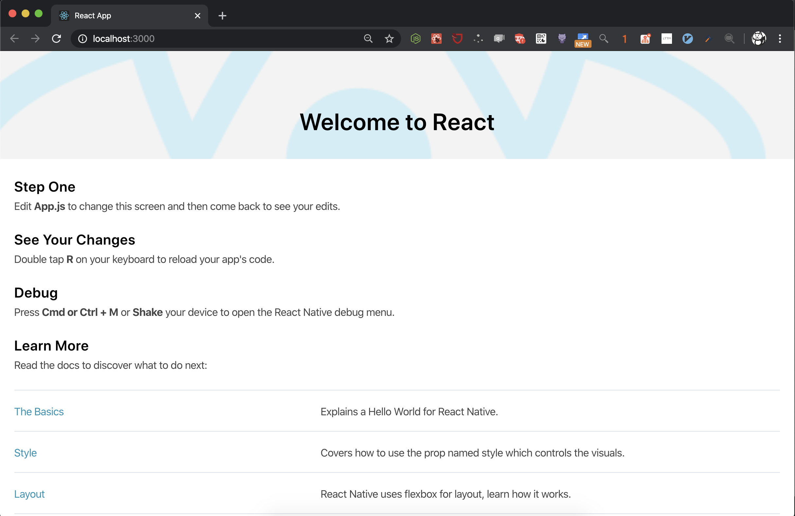
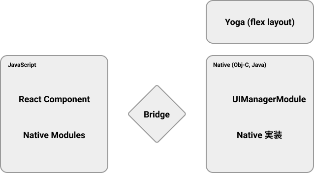
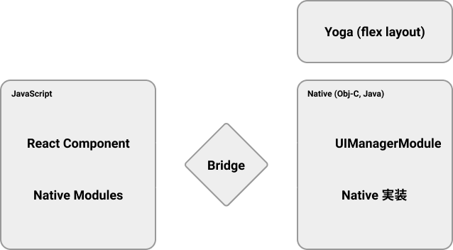
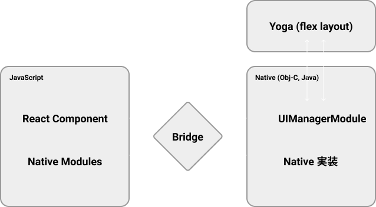
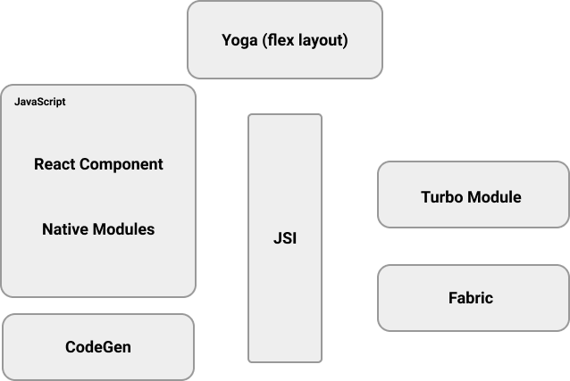

import { Link, Profile } from '../../components';
export { Themes } from '../../deck/Themes.tsx';

## Future of React Native

[Meguro.es #25](https://meguroes.connpass.com/event/159506/)
@naturalclar

{/* Title */}

---

## About Me

<Profile />

{/* Future of React Native と言うタイトルで発表させていただきます。 Naturalclar です。アメリカ人です。株式会社 Cure App でエンジニアとして React Native を使って治療アプリを開発しています。 また、React Native Community の Github Org に所属していて、いくつかのパッケージのメンテナンスをしたり、React Native 本体への Contribute を行っています。 */}

---

### React Native 

{/* 今日は、近年 React Native の内部で起きている変化について、そして React Native が今年どこへ向かっているのかについて発表します。 そもそも React Native を使ったことがある人ってどのくらいいますか？ React Native とは、Facebook が開発している、クロスプラットフォームのフレームワークで、React でコードを書いたら、それが iOS や Android といったモバイル環境で動くようになります。 */}

---

### Multi Platform

##### [react-native-windows](https://github.com/microsoft/react-native-windows)

##### [mac-catalyst](https://developer.apple.com/mac-catalyst/)

{/* 最近は Microsoft が React Native Windows に力を入れていて、Windows のネイティブアプリも React Native でかけるようになっています。 また、最近の iOS のアップデートで、iPad のアプリを macos のネイティブアプリとして使う技術も出てきたので、iPad のアプリをかける React Native は、実質 mac os のネイティブアプリがかけます。 */}

---

### React Native Web

{/* また、React Native Web と言うライブラリもあって、これは、React Native で書かれたコードがウェブ上でも動かせるようになるものです。つまり、ウェブで動く React から モバイルで動く React Native が生まれ、その技術を使って、ウェブで表示しています。ちょっと何言ってるかわからないですね。 */}

---

{/* つまり、React Native は Learn once, write everywhere, これを学ぶだけでどの環境でも動く、そういったフレームワークであると言うことです。 */}

---

### React Native architecture

{/* これまでの React Native が内部的にどう動いていたのかについて少し説明します。 現在、React Native のアプリが実行されるとき、内部で３つのスレッドが立ち上がっています。 一つがJSスレッド、一つがネイティブスレッド、最後の一つは shadow thread です。 Java Script と Obj-C や Java といった Native 層の間には Bridge というものが存在しています。 これは、JavaScript と Native 間で通信するためのもので、お互いに JSON で Encode されたメッセージを送りあいます。 JavaScript と Native 層はお互いの存在を認知していないので、必然的に間で起こる通信はすべて非同期で行われます。 View について。 React Reconciller が UICommand を bridge 経由で UIManager Module に渡します。 UIManager Module は shadow node を作成し、Yoga に渡して、レイアウトが作成されます。 Module について。 Bluetooth などの Native Modules は Bridge を通して非同期的に Java/ObjC のコードに渡り、そこから実行されます。 */}

---

### React Native architecture

---

### React Native architecture

---

## React Native Re-architecture

{/* これから起こる React Native の Re-architecture について説明します。 React Native の Re-architecture は 2018年に最初に発表されたもの。 */}

---

### React Native Re-architecture

[discussions-proposals](https://github.com/react-native-community/discussions-and-proposals)

- JSI
- Turbo Modules
- Fabric
- Initialization
- CodeGen

{/* Re-architecture */}

---

### JSI

- Java Script Interface
- Wrapper for JavaScript Engine
- Invoke C++ methods from JavaScript
- [Available in the react-native repo](https://github.com/facebook/react-native/tree/master/ReactCommon/jsi)

{/* まず最初に、JSIについて説明します。 JSI とは Java Script Interface の略で、JavaScript Engine のラッパーとして働きます。 React Native では現在 JSC、JavaScriptCore というものが JavaScriptEngine として機能していますが、JSIの登場によって、 Google の V8 など、 JavaScriptEngine を使用することも可能となってきます。 実際、react-native-v8 というライブラリがあり、内部で JSC の代わりに v8 を使うためのライブラリとなっています。 ですが、JSI の真の価値は JavaScript が C++ へのリファレンスを持つことができるようになるということです。 つまり、C++ のメソッドを JavaScript から呼び出したり、C++ から JavaScript のメソッドを呼び出すことが可能となります。 これは今までの Bridge と違い同期的に発生するものです。 さらに、C++ は iOS, Android の両端末で動かすことができます。Objective-C は C の superclass のようなものですし、Java は JNI を通して C++ のコードを呼び出せます。 現在、ReactNativeのリポジトリの中にすでに実装があります。 まだドキュメント化はされていませんが、だいぶ仕様は固まってきているみたいです。 仕様が固まれば Hermes の様に独自のリポジトリとして提供されると思います。 */}

---

### Turbo Modules

- Native Modules through JSI
- Available in the react-native repo

---

### Fabric

- Rerenderer
- ViewManager
- Link with Yoga
- Planned Mid 2020

{/* これもまた、仕様が固まれば、OSSとして公開される予定です。 */}

---

### Initialization

- Removal of the Bridge
- Faster Start up time
- Planned Late 2020

---

### CodeGen

- Converting types to C++ types
- Works with FlowType, TypeScript
- Available in the react-native repo

---

### React Native Re-architecture

---

### まとめ

React Native は 2020年に生まれ変わります！

---

### 参考

<ul>
  <li>
    <Link href="http://blog.nparashuram.com/2019/01/react-natives-new-architecture-glossary.html">React Native's new architecture</Link>
  </li>
  <li>
    <Link href="https://formidable.com/blog/2019/react-codegen-part-1/">The New React Native Architecture Explained</Link>
  </li>
  <li>
    <Link href="https://www.youtube.com/watch?v=52El0EUI6D0">The New React Native - React Native EU</Link>
  </li>
  <li>
    <Link href="https://www.youtube.com/watch?v=7gm0owyO8HU">React Native: the Past, the Present and the Future - React Advanced</Link>
  </li>
  <li>
    <Link href="https://www.youtube.com/watch?v=5sQw8C36Xa4">Building React Native</Link>
  </li>
  
</ul>

---

THANK YOU
