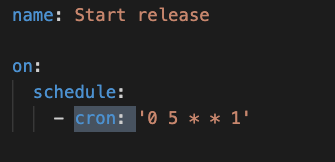
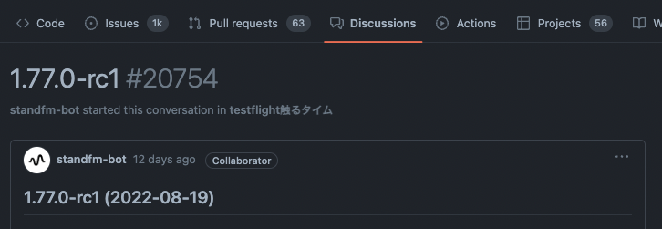
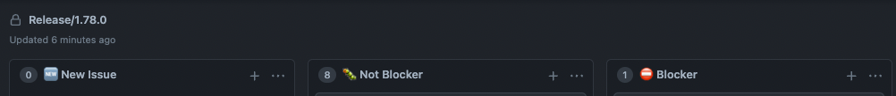
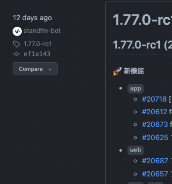
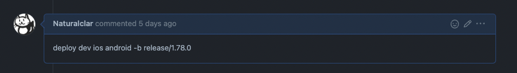
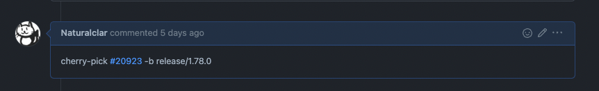
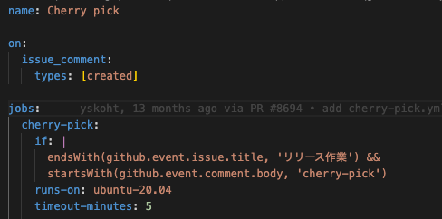
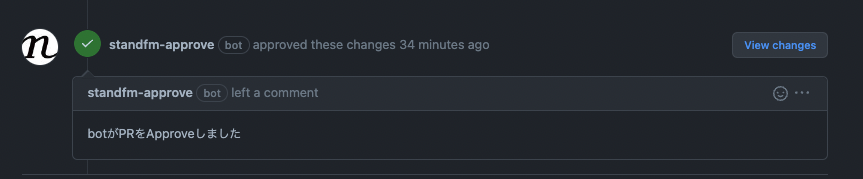
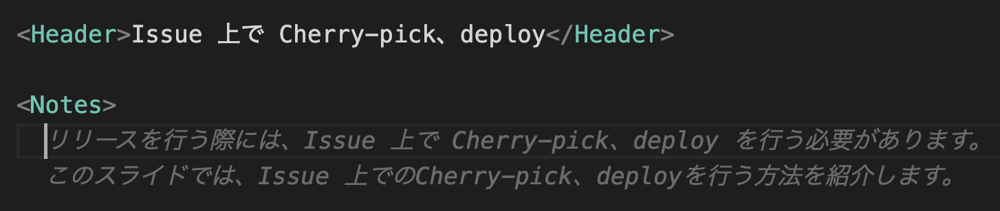

import { AlignLeft, Header, Profile } from '../../components';
export { Themes } from '../../deck/Themes.tsx';

## Release Flow Automation

[TECH STAND #9](https://standfm.connpass.com/event/256786/)
@naturalclar

{/* Release Flow Automation というタイトルで発表させていただきます。よろしくおねがいします。 */}

---

<AlignLeft>

<Header>About Me</Header>

<Profile />

{/* まずは簡単に自己紹介させてください。 株式会社 Stand.fm のエンジニアの Jesse と申します。 普段はアプリの音声周りの機能の実装とかをしています。 社外活動としては React Native Community という GitHub Org にも所属しており、 弊社アプリでも使用している React Native の周辺モジュールのメンテナンス等を行っています。 */}

</AlignLeft>

---

<AlignLeft>

<Header>話すこと</Header>

- Stand.fm での自動化の取り組み
- こういう使いかたもできる！GitHub Actions
- GitHub Discussions, GitHub Projects

{/* 今回発表する内容としては、まず、Stand.fm内でどういう事を自動化しているかについて、言える範囲で共有していこうと思います。 自動化にあたって今回のイベントの趣旨でもあるGitHubの機能について、 GitHub Actions や GitHub Discussions、 GitHub Projects など色々使っているので、それぞれどういった 使い方をしているかを軽く紹介していこうと思っています。 */}

</AlignLeft>

---

## Stand.fm での自動化の取り組み

---

<AlignLeft>

<Header>Stand.fmでの自動化の取り組み</Header>

- リリースサイクルは基本的に週１回
- リリースオーナーは交代制
- 交代先は GAS で自動化されている
- どのエンジニアでもリリース作業が行える体制

{/* Stand.fm のアプリは基本的に毎週アップデートをリリースしています。 その際にリリース作業を担当するリリースオーナーというのがいるのですが、それは毎回交代制で行っています。 交代先を決めるのも自動化されているんですが、ここはGitHub Actions ではなくGoogla App Script で行っています。 基本的に交代先が誰であってもリリース作業ができる様に体制を整えています。 */}

</AlignLeft>

---

<AlignLeft>

<Header>GitHub Actions First Steps</Header>

- テストの実行
- Format の実行
- 型チェックの実行
- ビルドできるかの確認
- デプロイの自動化

</AlignLeft>

---

<AlignLeft>

<Header>自動化していること</Header>

- リリース用 Issue の作成
- リリースブランチの作成
- アプリバージョンの更新
- 内部テスト用の GitHub Discussions の作成
- QA 用の GitHub Project の作成
- リリースノートの Draft 作成

{/* 弊社ではリリースに関わる様々な部分を自動化しています。 これらは GitHub Actions で実現されています。 リリース用Issueでは、各リリース作業で必要な手順が記載されており、初めてリリースオーナーになった場合でも迷う事なくリリース作業が進められます。 */}

</AlignLeft>

---

<AlignLeft>

<Header>リリース用Issueの作成</Header>

  <ul>
    <li>毎週決まったタイミングで実行</li>
    <li>GitHub API で Issue の作成</li>
    <li>作成された Issue のピン留め</li>
    <li>終了時、Slackに通知</li>
  </ul>

  

</AlignLeft>

{/* リリース用Issueには、リリースオーナーが行う手順がチェックボックスで羅列されています。 */}

---

<AlignLeft>

<Header>内部テスト用の GitHub Discussions の作成</Header>

  <ul>
    <li>Test Flight 触るタイム</li>
    <li>GitHub Api で Project を作成</li>
    <li>PMやEngでリリースビルドを触る</li>
    <li>問題点、改善点を洗い出す</li>
    <li>Discussion のコメントから Issue 化</li>
  </ul>

  

</AlignLeft>

---

<AlignLeft>

<Header>QA 用の GitHub Project の作成</Header>

  <ul>
    <li>GitHub Api で Project を作成</li>
    <li>QA が起票したIssueを自動追加</li>
    <li>PM が Issue の blocker 判定</li>
    <li>Blockerの修正・Revertを管理</li>
  </ul>

  

</AlignLeft>

---

<AlignLeft>

<Header>リリースノートの Draft 作成</Header>

  <ul>
    <li>GitHub Api で Release の作成</li>
    <li>PR Label の Issue が自動追加</li>
    <li>QA終了時に修正含んだリリースノートを作成</li>
  </ul>

  

</AlignLeft>

---

<AlignLeft>

<Header>半自動化していること</Header>

- アプリ、サーバーのデプロイ
- リリースブランチへの Cherry-pick
- DB のマイグレーション
- AppStore, Google Play へのリリース

{/* 弊社では、毎週リリースオーナーを交代制にしています。 GitHubの機能をフル活用しています。 */}

</AlignLeft>

---

<AlignLeft>

<Header>アプリ、サーバーのデプロイ</Header>

  <ul>
    <li>コメントからデプロイが可能</li>
    <li>GitHub Actions でコメントの内容を確認して実行</li>
    <li>release branch 以外にも対応可能</li>
    <li>Firebase App Distribution で機能テスト</li>
    <li>アプリのビルドはfastlaneで実行</li>
  </ul>

  

</AlignLeft>

---

<AlignLeft>

<Header>リリースブランチへの Cherry-pick</Header>

  <ul>
    <li>コメントからPR番号を指定</li>
    <li>master から merge commit を cherry pick</li>
    <li>コンフリクト時などもSlackに通知</li>
  </ul>

  

</AlignLeft>

---

<AlignLeft>

<Header>Stand.fmでの自動化の取り組み</Header>

- 18 共有 Actions
- 26 automation scripts
- 39 workflows

{/* 18 共有Actions 26 automation scripts 39 workflows */}

</AlignLeft>

---

<AlignLeft>

### 基盤チームに感謝:bow:

</AlignLeft>

---

<AlignLeft>

<Header>コメントの内容による操作</Header>

  <ul>
    <li>GitHub Actions で用意されている Expressions</li>
    <li>https://docs.github.com/en/actions/learn-github-actions/expressions</li>
  </ul>

  

</AlignLeft>

---

<AlignLeft>

<Header>その他 GitHub Actions の活用法</Header>

  <ul>
    <li>特定 folder に追加されたファイルを自動的に Approve する</li>
    <li>Cherry-pick 漏れがないかの確認</li>
  </ul>

  

</AlignLeft>

---

<AlignLeft>

<Header>まとめ</Header>

- GitHub Actions で様々なタスクを自動化しよう
- タスク管理も Discussion も GitHub で完結可能

{/* 余談ですが、このスライドを用意している中 GitHub Copilot を試していたのですが、サジェストされる文章が小泉構文みたいになっていて面白かったです。 */}

</AlignLeft>

---

---

THANK YOU
