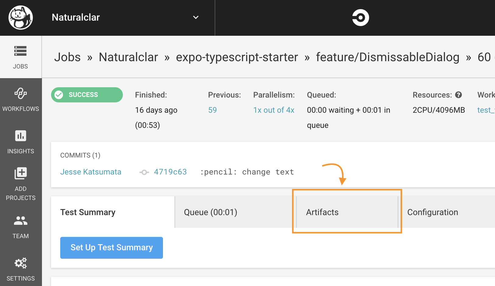
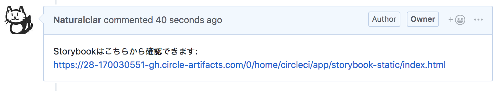
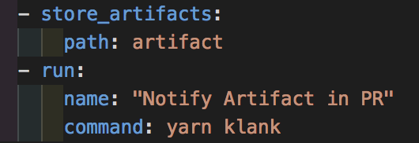
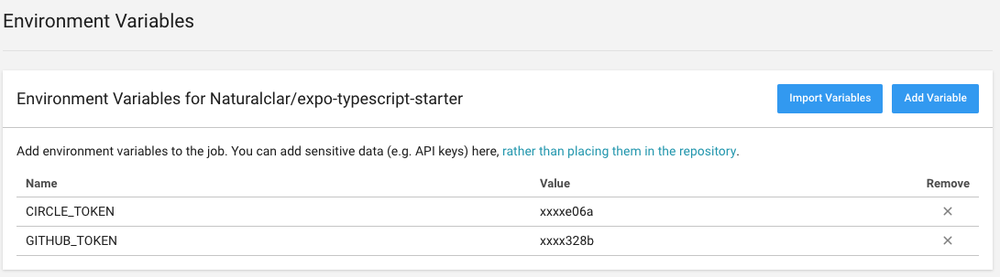
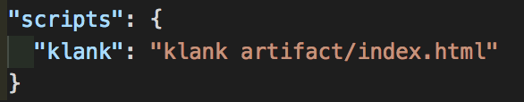

import { docco } from 'react-syntax-highlighter/styles/hljs'
import { CodeSurfer } from 'mdx-deck-code-surfer'
export { swiss as theme } from 'mdx-deck/themes'
import { Layout } from '../components'

<Layout>

### Circle CI Artifacts によるレビューの効率化

CircleCI ユーザーコミュニティミートアップ #3

#### https://circleci.connpass.com/event/123860/

#### [@natural_clar](https://twitter.com/natural_clar)

</Layout>

---

<Layout>

## アーティファクト使ってますか？

</Layout>

---

<Layout>

### Circle CI Artifact

- ビルドされた`.jar` ファイルや `.ipa` ファイルなどを格納できる。
- 指定されたパスの中身を S3 に格納。
- https://circleci.com/docs/2.0/artifacts/

</Layout>

---

<Layout>

### 静的サイトの Artifact

- 静的サイトのプレビュー
- Storybook のプレビュー
- Test Coverage Report

</Layout>

---

<Layout>

### 毎回 Artifact を見に行くのは手間では？ :thinking_face:

</Layout>

---

<Layout>

## Klank

</Layout>

---

<Layout>

### Klank

- https://github.com/Naturalclar/klank
- 指定パスの Artifact を PR に対してコメントする
- パッと見に行けるので効率がいい

</Layout>

---

<Layout>

## 使い方

</Layout>

---

<Layout>

- config.yml で `store_Artifacts` する

</Layout>

---

<Layout>

- Project の環境変数に `CIRCLE_TOKEN`, `GITHUB_TOKEN` をいれる

</Layout>

---

<Layout>

- npm scripts に Artifact のパスをいれる

</Layout>

---

<Layout>

## 実践デモ

</Layout>

---

<Layout>

### セキュリティ

- Private Repo は Circle CI アカウントによって保護
- Circle CI にログインしていなければ閲覧不可

</Layout>

---

<Layout>

### 自己紹介

- Jesse Katsumata アメリカ人 :flag-us:
- CureApp - React Native を使った治療アプリの開発

##### Twitter: [@natural_clar](https://twitter.com/natural_clar) Github: [@Naturalclar](https://github.com/Naturalclar)

</Layout>

---

<Layout>

## ありがとうございました

</Layout>
