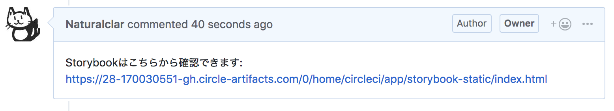
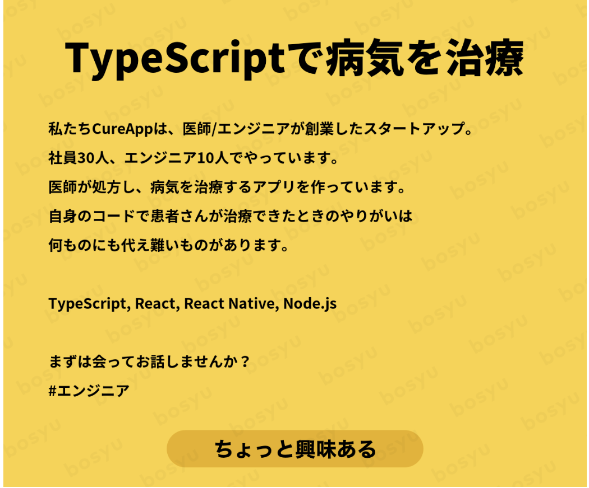

export { Themes } from '../../deck/Themes.tsx';

### React Native Web と Storybook によるアプリケーション開発の効率化

- @natural_clar
- RNstartup #2

---

### 自己紹介

- Jesse Katsumata
- CureApp
- React Native を使った治療アプリの開発
- アメリカ人 :flag-us:
- Twitter: [@natural_clar](https://twitter.com/natural_clar)
- Github: [@Naturalclar](https://github.com/Naturalclar)


---

## storybook とは :book:


---

- Component を表示して、見た目が期待通りであるかテストする為のツール
- React, React-Native, Vue 等いろんなライブラリで使える

---

### react-native 版の storybook

- `@storybook/react-native`

---

### RN 版 Storybook の利点 :tada:

- 実機での見た目の確認が行える
- Expo アプリとしてデザイナーチームに共有できる

---

### RN 版 Storybook の欠点 :rain_cloud:

- エミュレータの立ち上げに時間がかかる
- Port を取られるので実行中、アプリの方の動作確認が行えない

---

## もっと効率良く行えないか？ :thinking_face:

---

## react-native-web

---

- react-native 特有の`<View>`や`<Text>`等のコンポーネントを Web で表示させる
- Twitter Lite で使用されている

---

### react-native の storybook を web で表示させる

---

- `.storybook`に`webpack.config.js`をいれる
- alias を使って`react-native`を`import`してる箇所を`react-native-web`に変換する
- `@storybook/react`の方を使用

---

#### webpack.config.js

.storybookフォルダにいれる

```js 
module.exports = (config, configType) => {
  config.resolve = {
    modules: ['node_modules'],
    extensions: ['.web.js', '.js', '.json', '.web.jsx', '.jsx'],
    alias: {
      'react-native$': require.resolve('react-native-web'),
    },
  }
}
```

---

#### webpack.config.js

storybookのconfig

```js {1}
module.exports = (config, configType) => {
  config.resolve = {
    modules: ['node_modules'],
    extensions: ['.web.js', '.js', '.json', '.web.jsx', '.jsx'],
    alias: {
      'react-native$': require.resolve('react-native-web'),
    },
  }
}
```

---

#### webpack.config.js

aliasの設定

```js {5-7}
module.exports = (config, configType) => {
  config.resolve = {
    modules: ['node_modules'],
    extensions: ['.web.js', '.js', '.json', '.web.jsx', '.jsx'],
    alias: {
      'react-native$': require.resolve('react-native-web'),
    },
  }
}
```

---

## RN-Web 版 Storybook の利点

- エミュレータの起動を待つ必要が無い
- アプリと Storybook を同時に開ける
- 静的サイトとして楽に共有できる！

---

## CircleCi Artifacts

---

- CircleCI が持つ S3 に立てれるサイト
- build-storybook でビルドした Storybook を格納させる
- PR に自動的に URL を送るコメントを別途作成



---

  #### config.yml

circleciのConfigファイル

```yaml 
- run:
    name: "Build Storybook"
    command: yarn storybook:build
- store_artifacts:
    path: storybook-static
- run:
    name: "Report storybook URL to Pull Request"
    command: 'scripts/report-artifact storybook-static/index.html'
```

---

#### config.yml

storybookの作成

```yaml {1-3}
- run:
    name: "Build Storybook"
    command: yarn storybook:build
- store_artifacts:
    path: storybook-static
- run:
    name: "Report storybook URL to Pull Request"
    command: 'scripts/report-artifact storybook-static/index.html'
```

---

#### config.yml

artifactに設定

```yaml {4-5}
- run:
    name: "Build Storybook"
    command: yarn storybook:build
- store_artifacts:
    path: storybook-static
- run:
    name: "Report storybook URL to Pull Request"
    command: 'scripts/report-artifact storybook-static/index.html'
```

---

#### config.yml

PRにコメントするスクリプト

```yaml {6-8}
- run:
    name: "Build Storybook"
    command: yarn storybook:build
- store_artifacts:
    path: storybook-static
- run:
    name: "Report storybook URL to Pull Request"
    command: 'scripts/report-artifact storybook-static/index.html'
```


---

# ありがとうございました
