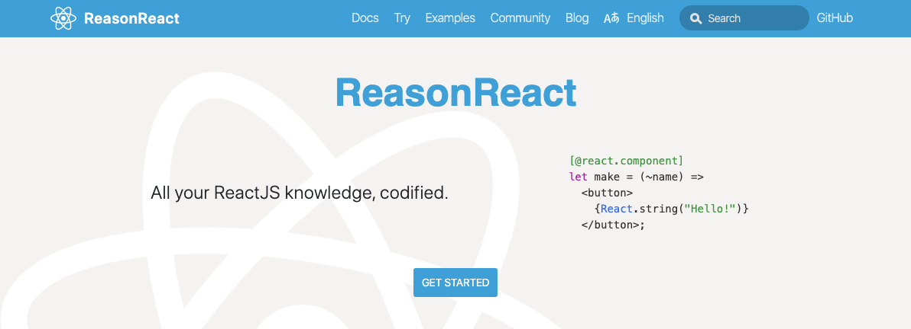
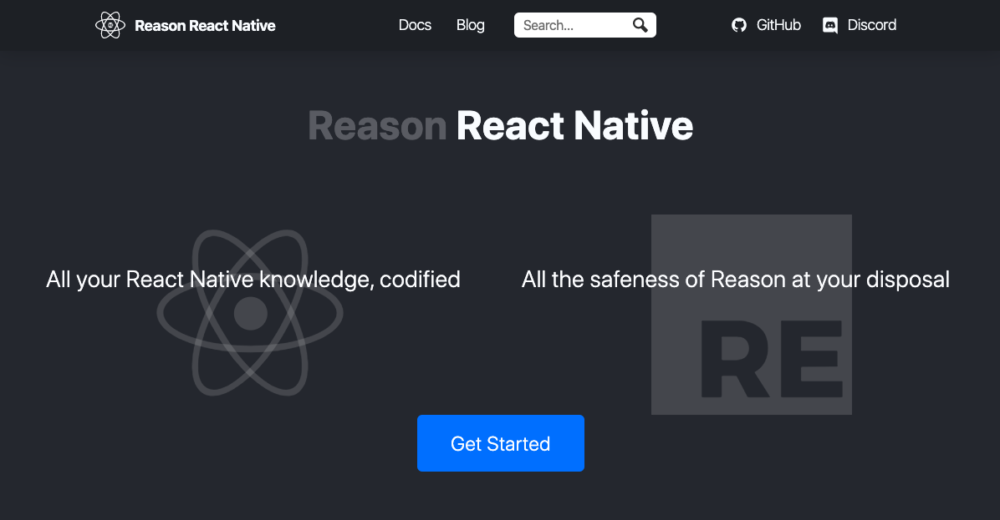

import { Avatar, Center, Logo, Profile, Title } from '../../components';
export { Themes } from '../../deck/Themes.tsx';

## Reason と TypeScript を繋ぐ genType

[ginzajs #6](https://ginzajs.connpass.com/event/150708/)
@naturalclar

{/* Title */}

---

<Center>
  <Title label="About Me" />
  <Avatar />
  <Profile />
</Center>

{/* About me */}

---

<Logo name="reason-long" style={{ backgroundColor: "white" }} size={200} />

{/* Have you used Reason */}

---

<div style={{ display: "flex", justifyContent: "space-around" }}>
  <Title label="How it works" />
    <div style={{ display: "flex", alignItems: "center" }}>
      <Logo name="reason" />
      <Logo name="ocaml" style={{ paddingRight: 10 }} /> →
    </div>
    <div style={{ display: "flex", alignItems: "center" }}>
      <Logo name="bucklescript" /> →
    </div>
    <div style={{ display: "flex" }}>
      <Logo name="javascript" />
    </div>
</div>

{/* Reason Overview */}

---



{/* Since Reason is made by facebook, and React is also made by facebook, it's no surprise that there is a support for using React in Reason. */}

---



{/* There is also support for React Native. It currently has support for react native 0.60, which is relatively new. */}

---

<Center>
  <Title label="Reasonの利点" />
  <ul>
      <li>高速ビルド</li>
      <li>優しいエラーメッセージ</li>
      <li>静的型言語</li>
      <li>GraphQLサポート</li>
  </ul>
</Center>

{/* Pros of Reason */}

---

## 移行にはどうすれば？ :thinking_face:

---

# genType

---

<Center>
  <Title label="genType" />
  <h3>Reasonの型生成ツール</h3>
  <div style={{ display: "flex" }}>
      <div style={{ display: "flex", alignItems: "center" }}>
        <Logo name="reason" style={{ paddingRight: 10 }} /> ↔
      </div>
      <Logo name="javascript" style={{ paddingLeft: 10 }} />
      <Logo name="flowtype" />
      <Logo name="typescript" />
  </div>
</Center>

---

#### Creating component in Reason

```reason
[@react.component]
let make = () => <div>Hello World!</div>;
```

---

#### Initialize React Component

```reason {1}
[@react.component]
let make = () => <div>Hello World!</div>;
```

---

#### you can add props

```reason
[@react.component]
let make = (~label: string) => <div>{label}</div>;
```

---

#### you can add styles

```reason
[@react.component]
let make = (~color: string, ~size: string) => {
  let style =
    ReactDOMRe.Style.make(~background=color, ~width=size, ~height=size, ());
  <div style />};
```

---

#### you can add styles

```reason {3-4}
[@react.component]
let make = (~color: string, ~size: string) => {
  let style =
    ReactDOMRe.Style.make(~background=color, ~width=size, ~height=size, ());
  <div style />};
```

---

#### you can use hooks

```reason
[@react.component]
let make = (~color: string, ~size: string) => {
  let (count, setCount) = React.useState(() => 0);
  let style =
    ReactDOMRe.Style.make(~background=color, ~width=size, ~height=size, ());
  <div style>
    <button onClick={_ => setCount(_ => count + 1)}>
      {React.string("You clicked " ++ string_of_int(count) ++ " times")}
    </button>
  </div>;
};
```

---

#### export type by adding genType

```reason
[@react.component]
let make = (~color: string, ~size: string) => {
  let (count, setCount) = React.useState(() => 0);
  let style =
    ReactDOMRe.Style.make(~background=color, ~width=size, ~height=size, ());
  <div style>
    <button onClick={_ => setCount(_ => count + 1)}>
      {React.string("You clicked " ++ string_of_int(count) ++ " times")}
    </button>
  </div>;
};

[@genType]
let default = make;
```

---

#### using tsx component in Reason

```reason
[@bs.module "./Logo"] [@react.component]
external make: (~name: string, 'a) => React.element = "Logo";
```

---

ありがとうございました。
