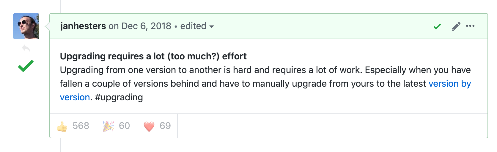
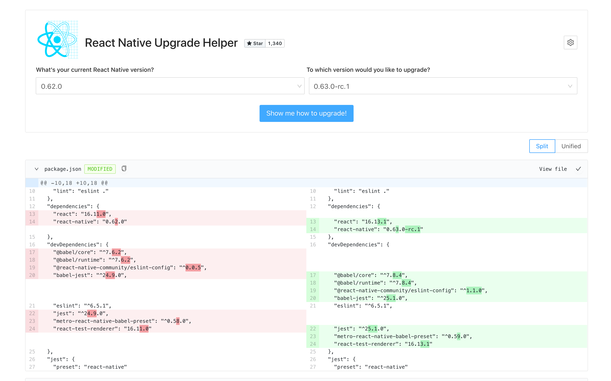
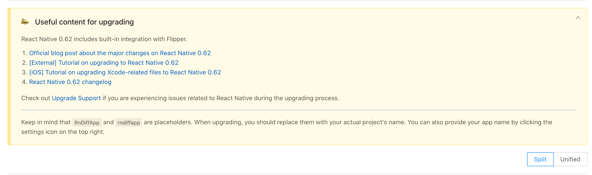

import { Profile } from '../../components';
export { Themes } from '../../deck/Themes.tsx';

## Upgrading React Native

[React Native Tech Blog #3](https://ducklings.connpass.com/event/174638/)
@naturalclar

{/* Upgrading React Native */}

---

## About Me

<Profile />

{/* Introduction */}

---

最近の React Native、DX が最高に良い。

---

### React Native Version History

- v0.57 - TypeScript Support
- v0.59 - React Hooks
- v0.60 - Auto Linking + Hermes
- v0.61 - Fast Refresh
- v0.62 - Flipper Support + Dark Mode

---

### Version が上がるにつれ DX は向上している

---

`npx react-native init` すれば最新の状態で開発できる。

---

では既存プロダクトは？

---

...:thinking_face:

```
package.json
{
  "name":"kizon-no-product",
  "dependencies": {
    "react": "16.4.1",
    "react-native": "0.56.1"
  }
}
```

---

Upgrading は辛い 😭

単純に package.json の RN のバージョンを上げただけではまず動かない。

---

### [What do you dislike about React Native?](https://github.com/react-native-community/discussions-and-proposals/issues/64)



---

### 必要な知識

- JS (React) の知識
- iOS のビルド知識
- Android のビルド知識
- その他、Metro などの固有知識

---

無理ゲーでは？:thinking_face:

{/* 現状、iOSやAndroidのビルド知識があったらそもそもReact Native 使わない事が多いと思う */}

---

### [Upgrade Helper](https://react-native-community.github.io/upgrade-helper/)



---

### Upgrade Helper

- 各バージョンを新規で作成した時の diff を表示。
- [@pvinis 氏](https://github.com/pvinis)が作成した[rn-diff-purge](https://github.com/react-native-community/rn-diff-purge)をベースとした GUI。
- 時間はかかるかもしれないが確実。

---

## XCode の Diff は？



---

Upgrade-Helper 使ってもやっぱり動かなかったら？

---

## [Upgrade-Support](https://github.com/react-native-community/upgrade-support)

- Upgrade で詰まった箇所を相談できるリポジトリ
- 他の人がどう詰まったかも issue で見れる

---

最高の DX で React Native を開発しよう！

---

THANK YOU
