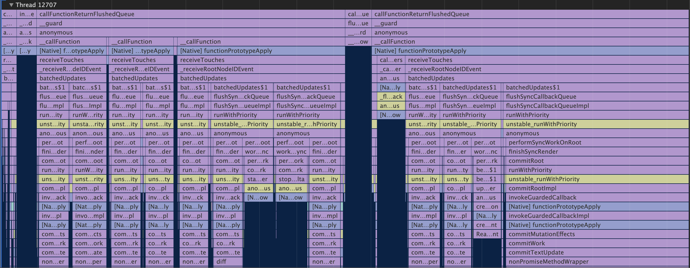

import { Profile } from '../../components';
export { Themes } from '../../deck/Themes.tsx';

## What's new in React Native 0.64

[React Native Meetup #11](https://react-native-meetup.connpass.com/event/204535/)
@naturalclar

{/* Title */}

---

## About Me

<Profile />

{/* Introduction */}

---

## Hermes support for iOS


---

### Hermes support for iOS

- facebook 製の JS Engine
- js を bytecode に変換する
- スペックの低い端末でも快適に動く
- iOS アプリも hermes でビルド可能に

---

## `profile-hermes` cli



---

### `profile-hermes` cli

- [hermes-profile-transformer](https://github.com/react-native-community/hermes-profile-transformer)
- hermes のパフォーマンス測定が可能
- Chrome の Profiler が認識可能な json を吐き出す

---

## Hermes with Proxy support

---

### Hermes with Proxy support

- Proxy を使ってるパッケージが hermes 下でも動作するように
  - MobX
  - React Native Firebase

---

## Inline Requires

---

### Inline Requires

- js module を必要になった取得するように変更する
- 以前から機能としてあったのがデフォルトで使われるように
- metro bundler の中で babel を使って変換するのでコードの変更は不要

---

#### Before

```jsx
import {MyFunction} from 'my-module';

function MyComponent(props) {
    const result = myFunction();

    render <Text>{result}</Text>;
}
```

---

#### After

```jsx
function MyComponent(props) {
    const result = require('my-module').MyFunction;

    render <Text>{result}</Text>;
}
```

---

## React 17

---

### React 17

- [React v17.0](https://reactjs.org/blog/2020/10/20/react-v17.html)
- [New JSX Transform](https://reactjs.org/blog/2020/09/22/introducing-the-new-jsx-transform.html)
- `import * as React from 'react'` が不要に
- Event handling が react で完結する用に

---

## M1 support for Flipper

---

## CodeGen について

---

### CodeGen について

- New Architecture の一部
- C++ to JS を繋ぐ JSI に必要
- Flow/TS から C++ の型情報を生成
- 外部パッケージが Turbo Modules や Fabric を使える用に OSS 化
- 0.64 ではまだ外部パッケージの為に最適化されていない

---

- [0.64 Discussion](https://github.com/react-native-community/releases/issues/214)
- [0.64 Changelog](https://github.com/react-native-community/releases/pull/216)

---

THANK YOU
